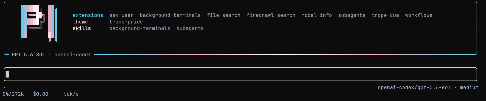

# Pi config

Personal configuration for [Pi](https://github.com/earendil-works/pi-mono).

To install the full setup, give this repository to your Pi agent and ask it to install it. Otherwise, clone the repository and take whatever looks useful.

The proper installation requires merging `agent/` into `~/.pi/agent/` and installing its dependencies. Your existing auth, sessions, and trust files should be preserved.

On Linux, Trope CUA is skipped automatically because it is only supported on Windows and macOS.

## Included

- Fully overhauled GUI with the `trans-pride` theme, startup header, boxed editor, and compact footer
- Prettified workflows, background terminals, subagents, dashboards, and tool output
- Resize-aware Facelift frames with syntax-highlighted reads and diffs
- `fd`, `rg`, Firecrawl, Ask User, and Trope CUA tools
- Custom models, settings, and keybindings

## Credits

Parts of this setup were copied or adapted from:

- [davis7dotsh/my-pi-setup](https://github.com/davis7dotsh/my-pi-setup)
- [wierdbytes/pi-wierd-stuff](https://github.com/wierdbytes/pi-wierd-stuff/tree/master/packages/facelift) for Facelift and the tool rendering

## License

[MIT](LICENSE) — use it, change it, and share it.
